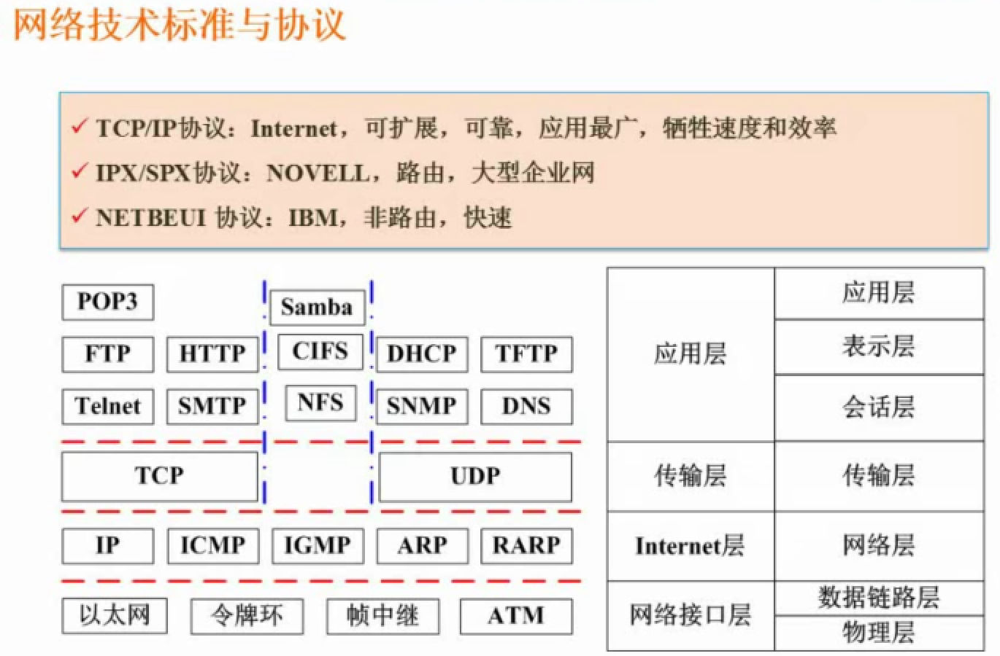

#### 计算机网络分类

按通讯距离分为广域网、局域网、城域网。

局域网(LAN),分布距离在10m左右、100m左右、1000米左右，传输速率在4Mbps~1Gbps；

城域网(MAN),分布距离在10Km，传输速率在50Kbps~100Mbps，城域网规范由IEEE802.6规范定义。

广域网(WAN),分布距离在100Km以上，传输速率在9.6Kbps~45Mbps，大多采用分布式网络。

#### OSI/RM七层模型

1. 物理层
2. 数据链路层 以桢为单位
3. 网络层 数据包中封装有网络层包头，其中 含逻辑地址信息，即源站点和目标站点的网络地址
4. 传输层 为会话层间提供建立、维护和取消传输连接的功能，信息传送单位在该层为报文。
5. 会话层
6. 表示层
7. 应用层

#### 无线网

无线网优势：移动性、灵活性、成本低、容易扩充

无线网分为

无限局域网(WLAN, 802.11, WiFi)

无线城域网(WMAN, 802.16, WiMax)

无线广域网(WWAN, 3G/4G)

无线个人网(WPAN,  802.15, Bluetooth)  十米左右 十米以内的通讯本称为无线个人网。

#### 网络接入技术

1. 有线接入 分为 

​     公用交换电话网络(PSTN)

​      数字数据网(DDN)

​      综合业务数字网(ISDN)

​       非对称数字用户线路(ADSL)

​       同轴光纤技术(HFC)

2. 无线接入 分为

   IEEE 802.11 （WiFi)

   IEEE 802.15 （蓝牙）

   红外 （IrDA）

   WAPI

3. 3G 分为 WCDMA(广泛用)，CDMA2000, TD-SCDMA(移动)

4. 4G分为为 LTE-Advanced(TDD,FDD)

   Wireless-Advanced(802.16m)(WiMAX)

   ​

#### IPv6

IPv6是设计用于替代现行版本IP协议(IPv4)的下一代IP协议。

IPv6的优势：
1. IPv4是采用2的32位地址，而IPv6的地址长度为128位，地址空间增大了2^96倍。

2. 灵活的IP报文头部格式。使用一系列固定格式的扩展头部取代了IPv4中可变长度的选项字段。
  IPv6中选项部分的出现方式也有所变化，使得路由器可以简单路过选项而不做任何处理，加快了报文处理速度。

3. IPv6简化了报文头部格式，字段只有8个，加快报文转发，提高吞吐量。

4. 提高安全性。身份认证和隐私权是IPv6的关键特性。

5. 支持更多的服务类型。

6. 允许协议继续演变，增加新的功能，使之适应未来技术的发展。

   ​

IPv6地址分类：
单播地址(Unicast): 用于单个接口的标识符。
任播地址(Anycast): 泛播地址。一组接口的标识符，IPv4广播地址。
组播地址(Multicast): IPv6中的组播在功能上与IPv4的组播类似。
